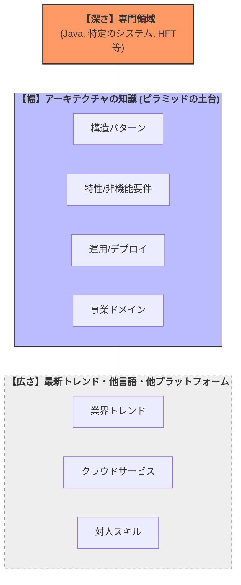

## 1. 一言で言うと？
開発者とアーキテクトでは求められる技術的要素の範囲が異なる。
開発者：良い仕事をするためにかなりの技術的な深さが求められる。
アーキテクト：アーキテクトらしく考え、アーキテクチャ視点で物事を見るために、かなりの技術的な幅が求められる。

## 2. 構造図 (Mermaid)

## 3. 特性（トレードオフの分析）

## 4. 重要な概念・キーワード

## 5. 示唆・実務への適用
- 現在の技術的に深い要素は何か？
	- Javaの開発経験10年以上
	- 金融(FX・証券ドメイン)